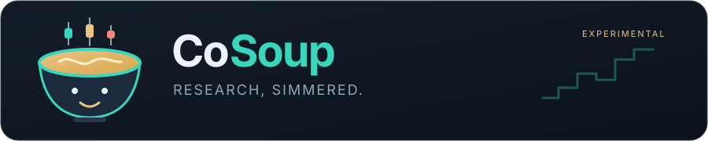
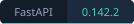

<p align="center">
  
</p>

<p align="center">
  <a href="apps/server/README.md"></a>
  <a href="apps/web/README.md"></a>
  <a href="apps/server/requirements.txt"></a>
  <a href="apps/web/package.json"></a>
  <a href="apps/mobile/package.json"></a>
  <a href="package.json"></a>
  <a href="LICENSE"></a>
</p>

<p align="center">
  <strong>A calmer workspace for stock research.</strong><br />
  Market signals, portfolio context and a research companion, in one pot.
</p>

<p align="center">
  <a href="docs/SETUP.md">Setup</a> ·
  <a href="apps/server/README.md">Server</a> ·
  <a href="apps/web/README.md">Web</a> ·
  <a href="apps/mobile/README.md">iOS</a> ·
  <a href="docs/OPERATIONS.md">CLI</a> ·
  <a href="docs/VALIDATION.md">Validation</a>
</p>

# CoSoup

Experimental personal research for US equity swing and medium/long-term opportunities. CoSoup combines Massive end-of-day data, public SEC filings, a self-hosted server, web and iOS clients, and an optional Codex research companion called **Steve**. It produces English JSON and Markdown reports and has no broker connection, order execution or paid-plan upgrade mechanism.

| In the pot | What you get |
| --- | --- |
| Market research | Configurable breakout and near-breakout screening, daily candles, relative strength and a 3D movement view on the web. |
| Portfolio context | A personal transaction journal, reviewed photo/document imports and explicitly authorized context for the research agent. |
| Home-server operations | Durable jobs, configurable schedules, historical snapshots and retention, with optional encrypted Cloudflare R2 archiving. |

<details>
  <summary>Meet Steve and the CoSoup bowl</summary>
  <p align="center">
    
  </p>
  <p>Steve cooks the research; you make the decisions. Switch between warm light and dark themes, or pause the animations. Steve tosses decorative stock symbols while jobs run and serves the bowl when a new report arrives; exact job progress and coverage stay visible.</p>
</details>

This is an alpha: optional integrations require private configuration and verification. Read the [validation notes](docs/VALIDATION.md) for what has actually been tested. Technology badges describe declared dependencies and the documented development toolchain; they are not CI status indicators.

## Applications

- [`apps/server`](apps/server/README.md): authenticated FastAPI service, durable jobs and scheduling, configurable private storage/R2 archiving, portfolio journal, reviewed document imports and an optional dedicated Codex worker. Designed for Docker Compose on a home Debian server.
- [`apps/web`](apps/web/README.md): responsive React research workspace, linked 3D movement and daily candles, portfolio/import review, history and operations.
- [`apps/mobile`](apps/mobile/README.md): Expo/React Native iOS client with native charts, private Keychain credentials and photo/document workflows.
- `packages/client` and `packages/design`: shared web/native transport contracts, metric/query helpers and design tokens.
- `stock_scanner/`: reusable provider, calendar, quality checks, screening and source-research library.
- `scanner.py`: standalone daily/weekly CLI. Its dependencies remain separate from the optional server dependencies.

Every server worker has its own module under `apps/server/workers/`; extension contracts live under `apps/server/adapters/`. Additional applications can be added under `apps/`.

## Quick start — macOS and Linux

Install and start Docker first. On macOS use [Docker Desktop](https://docs.docker.com/desktop/setup/install/mac-install/) for Intel or Apple Silicon; on amd64 Linux use [Docker Engine with Compose v2](https://docs.docker.com/engine/install/debian/), as a non-root account with Docker access. Setup does not require host Python/Node packages, npm, Make or Xcode.

From the repository root, deploy a local Mac test environment:

```sh
./setup.sh --mode dev --copy-token
```

The script builds and migrates the full Docker stack, waits for health and opens [the local web app](http://127.0.0.1:8081). Paste the owner token from the clipboard into Connect, then clear your clipboard. Application services use native ARM64 on Apple Silicon; the existing PostgreSQL deployment retains its pinned architecture.

For a Linux server, use your actual private HTTPS origin:

```sh
./setup.sh --mode prod --origin https://YOUR-NODE.YOUR-TAILNET.ts.net
```

Configure Tailscale Serve or another trusted HTTPS reverse proxy to forward that origin to `127.0.0.1:8081`. The [Debian/Tailscale guide](docs/DEBIAN_TAILSCALE.md) covers HTTPS and Mac/iPhone connection. Setup does not configure the proxy itself. Without an origin, prod prepares its env and stops so you can fill the address and rerun.

| Deployment | One editable configuration file | Default project |
| --- | --- | --- |
| macOS / `dev` | `~/.local/share/cosoup-dev/.env` | `cosoup-dev` |
| Linux / `prod` | `~/.local/share/cosoup-prod/.env` | `cosoup-prod` |

Edit **only that `.env`** for your actual `MASSIVE_API_KEY`, optional integrations and other settings, then rerun the same setup command. It generates the internal JSON/secret mounts and retains data and credentials. Dev and prod have separate databases and secrets. The script detects the OS; `--mode` selects the environment explicitly, and `--root /absolute/path` selects a custom private directory. Docker Desktop/host sleep pauses scheduling.

For the first scan, open **Home → Make a fresh serving**, uncheck **Offline: require existing dated cache**, choose **Company research → Current sources** if you want company facts and sources, select **Preview date coverage**, then **Queue scan**. Selecting company research turns offline off; offline scans provide technical screening only. Follow progress in **Activity**; initial acquisition needs 260 trading sessions and can take over an hour at the shared provider limit. Later online scans download only missing days. Offline scans require the selected session's inputs to be cached already.

Home centers on **Chat with Steve**. Sources and saved conversations open on demand; reports and background jobs remain in a separate drawer. Ask a follow-up, request a chart, start a new conversation, rename it, or archive and restore it. Codex resumes its native session through the existing dedicated account login. The application preserves owner-scoped messages and typed outputs while Codex manages reasoning, compaction and optional subagents. No API-key fallback is used.

Steve has trusted skills for dated research charts and portfolio documents. Offline chart tools inspect only approved cached data; the server supplies every plotted value and preserves source dates and coverage notes. Charts appear directly in the conversation with inspectable values. Daily screening and source ingestion remain background data workflows; a chat question does not initiate a provider scan.

Ask Steve to **understand a setup**, **check financial quality**, or **follow reported holdings**. Trusted offline research tools explain numeric filter thresholds, compare ATR and volatility, inspect 21/63/126-session relative strength, and filter the approved observation list without changing saved scanner rules. New scans also include verified-history market breadth and a separate bounded filter-review list. Financial tools calculate matching-period margins, free cash flow, cash conversion and supported prior-year growth with filing dates and explicit gaps. Institutional tools inspect concentration and exact-security overlap within a common quarter. Measurements are descriptive; stale prices, incomplete coverage and incompatible reporting periods remain visible. The same tool and skill contracts can be used by future account-authenticated backend adapters.

Attach PNG/JPEG screenshots, PDF statements or transaction CSVs from the chat composer. Local OCR/PDF extraction prepares evidence; images can also be shared with the connected agent through Vision. Choose the destination portfolio and explicitly permit document or portfolio sharing before sending. Steve can propose opening positions or transactions with source excerpts and unknown fields left blank. Edit and confirm the proposals in the chat before they enter the journal. The agent cannot confirm or write portfolio entries.

The account-authenticated backend adapter, shared context, skills, chart requests and portfolio-proposal contract form a provider-neutral boundary. The current implementation uses Codex; a future Claude adapter can implement the same interface with its own supported user-login flow. Claude is not connected in this release. Native session state remains private and separate from the dedicated login.

When a scan finishes, Home refreshes its latest report and candidate count. Open **Research** to inspect movement, daily candles and coverage details. It starts with the latest usable report and warns when a newer scan is blocked. A **Company research** notice explains whether source research ran and can prepare an online scan when it was disabled. A `partial_coverage` report can contain valid candidates alongside excluded or missing histories; a blocked scan shows its candidate count as unavailable. Research reads existing cached data, so changing the movement period does not start another provider download. Updating the application with the same setup command retains this cache.

For automated SEC access, set `SEC_USER_AGENT` in the private `.env` to a truthful application name and a reachable contact email, for example `SEC_USER_AGENT='CoSoup/0.2 contact@example.com'`, then rerun setup. The contact value is kept in a private read-only file mounted only into the scanner worker; it is not added to Compose environment values or reports. Missing or invalid contact configuration stops before any SEC request. Standalone scanner runs may use the same variable or a private `SEC_USER_AGENT_FILE`.

In **Research → Company filings & institutional holdings**, sync up to ten symbols and five manager CIKs directly from public SEC sources without a paid data plan or a new market scan. Blank symbols use the selected daily report's candidates. Defaults cover Berkshire Hathaway and Pershing Square. The saved research includes standard financial facts with their reported periods, recent filing links (including ownership/insider forms when discovered), cached annual/quarterly document excerpts, and up to two comparable 13F snapshots per manager. Charts compare financial periods of similar length; the full original documents remain available through their SEC links. 13F changes are share-count differences, not verified purchases or sales. Amendments, missing snapshots, nonstandard financial tags and incomplete filing discovery remain explicit gaps. Source access failures stop the sync and preserve a diagnostic report; they never establish an absence of holdings or opportunities.

To manage the local deployment:

```sh
./setup.sh --mode dev --action status
./setup.sh --mode dev --action logs
./setup.sh --mode dev --action down
```

On Linux use `--mode prod`, and include the same `--root` if customized. Stopping retains data. Use `./setup.sh --help` for options. See [the env reference and curl bootstrap](docs/SETUP.md), [Mac acceptance checks](docs/MACOS_LOCAL.md) and [validation records](docs/VALIDATION.md).

Steve uses a dedicated Codex login and requires verified runtime isolation before activation. Follow [Connect Steve with ChatGPT](docs/SETUP.md#connect-steve-with-chatgpt) to build the native worker, sign in and check its sandbox. Its private login survives setup updates.

## Optional developer command

Run `./cosoup help` for development, tests, web/iOS builds and Docker deployment. Install the command once from the checkout root:

```sh
make install-command
export PATH="$HOME/.local/bin:$PATH"
command cosoup help
```

The installed executable resolves this checkout through its symlink and can be used from any directory. Keep the PATH setting in your shell profile. `cosoup setup --mode dev` runs the same installer; `cosoup deploy-mac` is its Mac shortcut. `cosoup install` installs development dependencies; command installation itself needs only Python 3 and Make. Development requires Python 3.12+ and Node 24 LTS.

For a setup-managed default deployment, CoSoup discovers the recorded OS/mode root and project; `cosoup deploy` rerenders its env before deployment. `cosoup compose ...` uses the same generated Compose settings. Custom roots use `--private-root` or `COSOUP_PRIVATE`. Legacy manual deployments retain their data root/project selection and optional private `compose.macos.yaml`; their fallback defaults remain `/srv/stock-scanner` and project `stock-scanner`. `cosoup ios-export` bundles native assets, while `cosoup ios-build` requires a Mac with Xcode/signing. See the application guides before configuring private HTTPS and credentials.

For local Mac testing, follow [Run CoSoup locally on a Mac](docs/MACOS_LOCAL.md), including the Apple Silicon server-platform override, private configuration and browser login setup.

For a Debian backend with Mac/iPhone clients, follow [Debian with private Tailscale HTTPS](docs/DEBIAN_TAILSCALE.md). Tailscale Serve provides application access independently of SSH.

## Standalone scanner

From the repository root:

```sh
python3 -m venv .venv
.venv/bin/python -m pip install -r requirements.txt
.venv/bin/python -m unittest discover -s tests -v
.venv/bin/python scanner.py preflight
.venv/bin/python scanner.py daily
.venv/bin/python scanner.py weekly
```

Provision `MASSIVE_API_KEY` privately and set `SCANNER_STATE_DIR` to a protected directory outside the checkout. Do not put credentials or personal email addresses in Git. Initial ingestion loads 260 sessions conservatively, resumes cached progress, and can take over an hour. Later runs download missing days only.

Common/ordinary shares and common ADRs on supported US exchanges are screened across sectors and company sizes. SPY and IWM must pass validation. Reports document actual coverage and every failed filter; blocked or missing data is never described as an absence of opportunities.

Default thresholds: $5 minimum price; prior 50-session averages of 500,000 shares and $10 million dollar volume; close above the preceding 55-session high; at least 1.5x prior average volume; positive 63-session price change exceeding SPY; close above SMA50 above SMA200; at most 5% above the pivot and 15% above SMA50. Configure `config.json`; a separate near-breakout watchlist is available. Candidate counts are never forced.

Company research separates sourced facts, hypotheses and gaps. Financial/news access depends on provider entitlements. Signal price changes are observations, not trading returns. Server historical snapshots are separate from live signals.

See [calculation design](docs/DESIGN.md), [CLI operations](docs/OPERATIONS.md), [server deployment](apps/server/README.md), [server architecture](docs/SERVER_PLAN.md), and [validation methods](docs/VALIDATION.md).

## License

Code and documentation use the [MIT License](LICENSE), provided as is without warranty. Outputs are not investment advice or guaranteed results. MIT does not grant rights to Massive market data, third-party news/filings or dependencies; their terms and licenses still apply. Raw data, private reports and personal credentials are excluded from this public repository.
