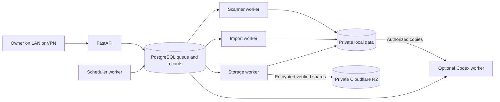

# Server architecture

The implemented application is under `apps/server`. [Deployment and API usage](../apps/server/README.md) describes supported behavior; [validation](VALIDATION.md) records test results separately from product documentation.

## Services and modules

| Module | Responsibility |
| --- | --- |
| `api/` | Authenticated HTTP endpoints, typed requests, owner boundaries and job submission |
| `persistence/` | Versioned PostgreSQL schema and separate service-role grants |
| `services/` | Jobs, coverage planning, reports, journal, storage policy and offline recovery |
| `adapters/` | Scanner, extractor, object-store and analyst extension contracts and implementations |
| `workers/scanner/` | Daily/range scans, weekly summaries and portfolio valuation |
| `workers/scheduler/` | Host-clock schedule evaluation, durable occurrences and catch-up |
| `workers/storage/` | Bounded archive shards, integrity verification, restoration and consistent database backups |
| `workers/imports/` | Resource-limited CSV/image/PDF parsing into review proposals |
| `workers/codex/` | Authorized source export and bounded dedicated terminal analysis |
| `profiles/` | Trusted dedicated analyst instructions |
| `deploy/` | Docker image targets and Compose service boundaries |

Each worker has an independent entrypoint and folder. Future applications belong under `apps/`; future providers/parsers/model runtimes implement the adapter contracts. The original scanner library/CLI remains independently usable.

## Request and job model

Long operations return HTTP 202 with job/status/events URLs. PostgreSQL `FOR UPDATE SKIP LOCKED`, expiring renewable leases and token fencing protect queue claims. Idempotency keys reject conflicting replays. Range progress commits per completed session. Cooperative cancellation stops at worker checkpoints. A lost worker can reclaim its checkpoint within the configured attempt budget; source failures require explicit resume after diagnosis.

Private records carry owner IDs and service queries enforce ownership. The initial token maps to one owner and grants full owner access. Separate login, token scopes and database row-level multi-user policies are future work; ownership fields alone are not multi-user authentication.

Job outcome and report quality are independent: completed computation can yield partial coverage. Missing/blocked data is never a zero-opportunity result. Live signals and historical reconstructed signals use distinct modes; weekly reports select that mode explicitly. Existing standalone SQLite signals are not automatically imported.

## Dates and scheduling

The host provides UTC time; explicit IANA zones determine local cron behavior. Market-close triggers use the exchange calendar with holidays/early closes plus a configurable settlement delay. Local triggers do not assume the market has closed. Nontrading range dates are reported as skipped; future/ineligible trading sessions are rejected.

Coverage-difference planning computes the union of each requested date's preceding 260-session window. Acquisition reuses completed cached dates and downloads missing dates under the shared conservative provider limiter. Historical runs use dated listings, split basis and separate research caches with a cutoff. Present-day earnings calendars are excluded; source financial archives are not guaranteed point-in-time data.

Schedules persist the next UTC occurrence and unique occurrence/job keys. `skip`, `run_once` and daily `catch_up` handle downtime; range limits still apply. Nonexistent DST times generate skipped events and repeated wall times run once. This is at-least-once processing; external effects are not promised exactly once.

## Persistence and isolation

A private deployment root outside Git contains `config/`, `secrets/` and `data/`. Managed subdirectories hold PostgreSQL, market snapshots, immutable reports, uploads, per-job workspaces, dedicated Codex profile, archive/restore staging, backups and event exports.

Compose uses separate service roles/secrets, unprivileged UID/GID, read-only root filesystems, dropped capabilities, bounded RAM/CPU/tmpfs and rotating Docker logs. PostgreSQL is internal and has no host port. API ingress binds localhost by default; scanner/storage/optional Codex wrappers also join an egress network. An ingress bridge enables host port publication. Docker bridges are not destination-level egress firewalls.

Workers share managed data needed by their trusted wrappers, with PostgreSQL/profile directories masked where appropriate. This is not a separate filesystem security principal per job. Import parsing runs a bounded child without wrapper credentials. Codex additionally requires an enforced outer namespace and the official CLI tool sandbox, exposing only authorized task copies and its dedicated profile. Nested sandbox/auth-file isolation must be verified on the host before enabling it. The application never mounts a Docker socket or operator home directory.

## Retention and recovery

Defaults: 200 GB decimal application capacity, 140/160/180 GB target/pressure/admission thresholds, monthly archive scheduling, 31-day eligibility, 300 hot market sessions, 7-day restore protection and 90-day searchable event retention. Thresholds, ages, cron, timezone, shard/reservation limits and service resources are configurable. Runtime policy updates do not replace filesystem quotas.

A dedicated host filesystem or quota enforces the ceiling. Filesystem usage mode includes otherwise masked PostgreSQL/WAL; tree mode can undercount those directories. OS/images and bounded Docker diagnostics need separately accounted space. Reservations and physical-free-space checks stop admission before capacity. If cloud archiving fails, existing unique data is retained and further work can be blocked by pressure.

Archive batches group eligible immutable artifacts by dataset/owner and write bounded `tar.zst` packages with manifests. The versioned `SSR1` envelope uses AES-256-GCM; it is not age. Full remote encrypted-object hash/length verification and committed catalog state are prerequisites for eviction. Shared reader locks prevent eviction during active reads, and recent inputs/restore TTLs remain protected. Encrypted object and member checks, safe-entry validation and bounded extraction protect restoration.

Nightly consistent PostgreSQL dumps are independently encrypted/archived immediately. Monthly data batching alone cannot guarantee no loss of fresh uploads after hardware failure. Configure more frequent unique-upload batches as required. Keep configuration/keys offline and perform a fresh-instance restore drill before enabling eviction. [Recovery operations](../apps/server/RECOVERY.md) supports offline unpacking without a surviving catalog; post-backup records may require manual reconciliation. Remote discovery, automatic catalog reconstruction and WAL point-in-time recovery are future adapters.

## Portfolio and analyst boundaries

USD journal accounting uses Decimal and FIFO, explicit timezone-aware transactions, deduplicating external references and auditable superseding corrections. Unknown opening basis/cash remains a gap. As-of valuation uses actual market-close time and unadjusted same-date bars. Known unrecorded splits or bad prices suppress affected valuations; complete corporate-action reconciliation remains the owner's responsibility.

Image/PDF/CSV extraction proposes source-backed fields and uncertainty; it never writes transactions. Only explicit reviewed confirmation applies rows atomically and idempotently. The optional Codex analyst receives chosen report copies, plus portfolio exports only with explicit authorization. It has no journal-write/broker capability, does not run arbitrary API-supplied CLI flags and does not claim current web research in this adapter.

SMTP delivery remains in the standalone CLI. A restricted, deduplicated server delivery worker and schedule dependency are future work. Private recipient/authentication settings are never public repository content. Live R2, model authentication and home-host durability are deployment prerequisites, not consequences of a successful build.
